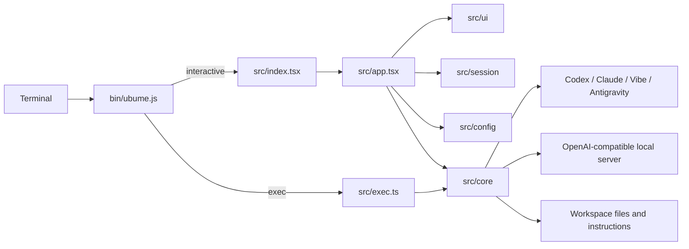

# Ubume Technical Documentation

## System overview

Ubume is an Ink/React terminal application that presents multiple coding-agent runtimes through one workspace-oriented interface. It supports interactive and headless prompts, provider/model discovery, reasoning and permission settings, streamed timelines, slash commands, session state, workspace trust, file-activity tracking, external CLI hand-off, and local OpenAI-compatible endpoints. Provider authentication remains owned by the provider CLI or local server.

This overview standardizes project documentation. The detailed [architecture](ARCHITECTURE.md), [source guide](SOURCE_GUIDE.md), [developer scripts guide](../scripts/README.md), and [release guide](RELEASING.md) remain authoritative for their domains.

## Runtime boundaries

`bin/ubume.js` is the installed Node ESM launcher. It identifies interactive versus headless use, resolves the TypeScript runtime, preserves terminal semantics, and hands control to the relevant entry point. `src/index.tsx` validates the terminal, installs terminal modes and resize handling, and mounts exactly one Ink root. `src/app.tsx` is the interactive composition root: it owns effective configuration, prompt execution, session lifecycle, routed provider state, command effects, and screen transitions.

`src/ui/` owns terminal presentation. Its `chrome`, `timeline`, `panels`, `render`, and `input` groups separate stable layout, transcript rendering, overlays, pickers, and composer behavior. Reducers and measurement helpers keep rendering deterministic. `src/session/` owns conversation lifecycle and accumulated runtime events. `src/commands/handler.ts` parses slash commands into typed actions; effects are executed by the app rather than hidden inside the parser.

`src/config/` resolves built-in defaults, user settings, trusted project configuration, profiles, and CLI overrides. It also owns trust and cache persistence. `src/core/` is effectful infrastructure: executable discovery, process execution, provider runtimes, model capability discovery, authentication probes, workspace guards, tool loops, local-server HTTP, parsing, diagnostics, and performance instrumentation. UI code consumes normalized core results and must not duplicate provider logic.

## Prompt and provider flow

1. Launch arguments and persisted settings are normalized into effective runtime configuration.
2. Workspace trust determines whether project configuration and instruction files may influence the run.
3. Provider registry/runtime modules report availability, selectable models, reasoning levels, context metadata, and whether a route supports in-app execution or only native launch.
4. The app creates a run, starts the selected process or local HTTP request, and translates provider-specific output into shared timeline events.
5. Session reducers accumulate reasoning, tool activity, file activity, assistant content, usage, status, and errors.
6. Ink renders the transcript and active composer while terminal ownership modules preserve native scrollback, focus, resize, and cleanup invariants.

External launch-only providers are handed the inherited terminal and remain outside active in-Ubume routing. In-app providers must adapt their events to common contracts without inventing models or capabilities not observed at runtime. Last-good caches accelerate startup but live discovery remains the source of truth when available.

## State, configuration, and safety

Mutable application data—settings, model caches, workspace-provider state, trust decisions, updates, and session artifacts—belongs in platform application-data directories. Only intentional project configuration belongs in the workspace. Configuration precedence and diagnostic source reporting are centralized in `src/config`; provider modules receive resolved settings rather than reading unrelated files ad hoc.

Executable resolution validates explicit paths, environment overrides, PATH candidates, and platform extensions before spawn. Command argument generation uses arrays and provider-specific builders to avoid quoting ambiguity. Workspace tools validate paths and writable roots. Authentication probes are read-only and tolerate missing CLIs. Debug output is environment-gated and must redact sensitive values. Cancellation and terminal cleanup are paired with every run and launch path.

## Development and release workflow

Use Bun for application work: `bun run dev`, `bun run start`, `bun run typecheck`, and `bun test`. Focused tests are colocated with source and cover parsers, reducers, terminal measurements, provider events, discovery, command vectors, persistence, and cleanup. `bun run build` refreshes generated build metadata through `scripts/gen-build-info.mjs` before type checking; `src/config/buildInfo.ts` should not be hand-edited.

Automation under `scripts/` installs local shims, launches the repository version, audits capabilities, generates metadata, and performs terminal smokes. Package publication follows `RELEASING.md`; `npm pack --dry-run --json` is the package-content gate before publication.

## Responsive provider and model pickers

Provider and model selection use the shared `src/ui/panels/responsivePickerViewport.ts` calculation. The shell first budgets the measured header, panel stage, composer, runtime status, padding, and terminal gutter. Each picker then subtracts only the rows it actually renders inside that border-safe panel body, such as its title and optional metadata. The remaining rows are the list capacity; there is no fixed provider or model page size.

If the complete list fits, every entry is rendered and no overflow position is shown. Longer lists retain one continuous scroll offset, move it only enough to keep the selected entry visible, and display the useful current position (for example, `Models · 11/20`) instead of a page range or permanent “more” rows. Home and End select the first and last entry; Page Up and Page Down move by the current calculated capacity. Selection and offset are clamped when data or terminal dimensions change.

At 100×22 the picker keeps its border, composer, runtime status, and all available short-list provider rows visible. On terminals up to 24 rows, every open overlay—including Theme, Mode, Settings, Auth, provider, and model panels—switches the existing header identity to its one-line compact form and omits the redundant panel-close hint before sacrificing option rows. Wider terminals restore the full logo and provider metadata columns. Display-width-aware truncation keeps long Unicode or model names within the panel at narrow widths. Extremely small dimensions remain protected by the shell's cramped-terminal fallback and non-negative viewport clamps.

Auth uses an essential-only compact view at short heights: title, backend/auth state, probe summary, all three preferences, controls, and recommended next action. Settings option groups use bounded, non-wrapping rows so one setting cannot overwrite another during incremental terminal rendering.

Generic selection screens use the same responsive viewport as provider/model lists rather than `ink-select-input`'s fixed limit. Theme selection therefore renders all nine registered themes at 100×22, starts on the committed theme, previews a highlighted theme immediately, restores the committed theme on Escape, and persists it only on Enter. Mode, Backend, writable-root, and other `SelectionPanel` consumers inherit the same continuous scrolling and Home/End/Page navigation.

The development startup screen no longer seeds a `Launch mode` transcript notice. `ubume-dev` opens directly to the logo/header, composer, and runtime status; `/clear` restores the same clean home screen. The `/workspace relaunch <path>` command remains available through normal command help.

The implementation changes are in `src/ui/panels/ProviderPicker.tsx`, `src/ui/panels/ModelPickerScreen.tsx`, `src/ui/panels/responsivePickerViewport.ts`, `src/ui/chrome/AppShell.tsx`, and the panel-hint composition in `src/app.tsx`. Focused tests cover five-item fit, long-list continuous scrolling, selection visibility, capacity growth, invalid dimensions, resize clamping, narrow rendering, and the 100×22 shell integration.

Verification performed for this change: `npm install`, `npm run build`, `npm test`, and the repository's `typecheck` script (there is no lint script in `package.json`). The actual CLI was also exercised in one live PTY at 80×20, 100×22, 120×30, and 160×40. Provider and 20-model panels stayed open through resize, retained selection, kept the composer/status usable, and expanded their visible rows with the terminal.

## Extension and failure rules

Add provider-specific discovery and execution under `src/core/providerRuntime`, executable resolution under `src/core/executables`, and external hand-off behavior under `src/core/providerLauncher`. New UI belongs in the matching domain folder; cross-domain foundations alone belong at `src/ui` root. Add deterministic command parsing in `src/commands`, then execute the action from the app composition layer.

Missing executables, invalid configuration, unavailable models, authentication failures, malformed streams, cancellation, resize, and terminal restoration must remain explicit states. Fallbacks may preserve usability but must never mislabel the active provider/model. Entrypoints and `app.tsx` may compose lower layers; core and session modules must not depend on UI components.
